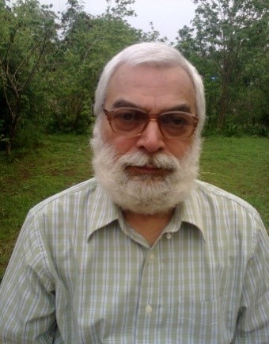

Dr A K Awasthi 
Former Professor and Head, Dept of English and Dean, School of Languages Director, Centre for Canadian Studies, Dr H S Gour Central University, Sagar (MP); known scholar in the field of critical theory- Indian aesthetics (Shaiva aesthetics) - and Canadian literature; evolved the Panckriya (five-fold) theory of criticism- highlighting the role of ideas as form and content combine approach to literature, which is applicable to any genre or facet of life; also known for his Idea Therapy technique for personality development; authored more than three dozen research papers; Visiting Fellow at the universities of Massachusetts and Ottawa in 2007-2008; contribution recognized in the form of nomination to the Governing Council of the prestigious Sahitya Akademi (National Body of Letters), New Delhi in 2002; contributed to educational reform and circulated Swavlambi Education based on collective wisdom of ancient Gurukul, Gandhian and Scientific thought for 21st century India. At present working as freelance translation expert and also working with IGNCA and ICPR, New Delhi.  E-mail: akawasthi2@gmail.com 

